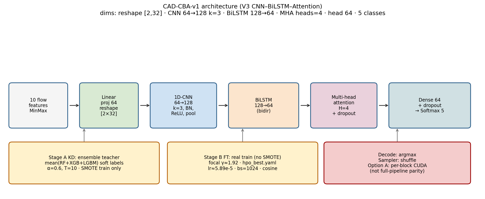
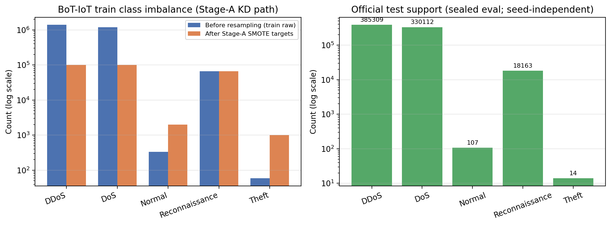
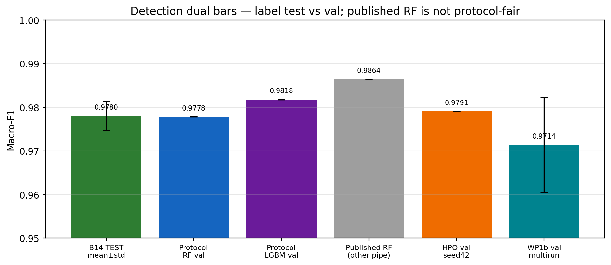
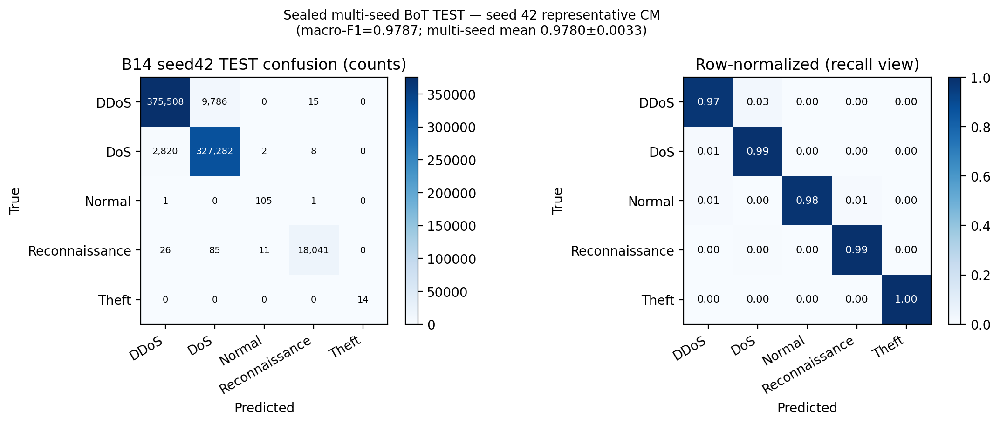
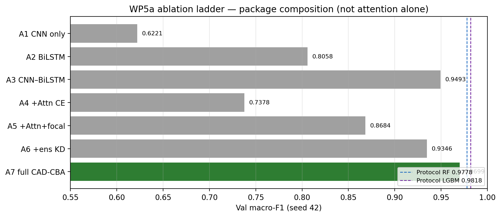
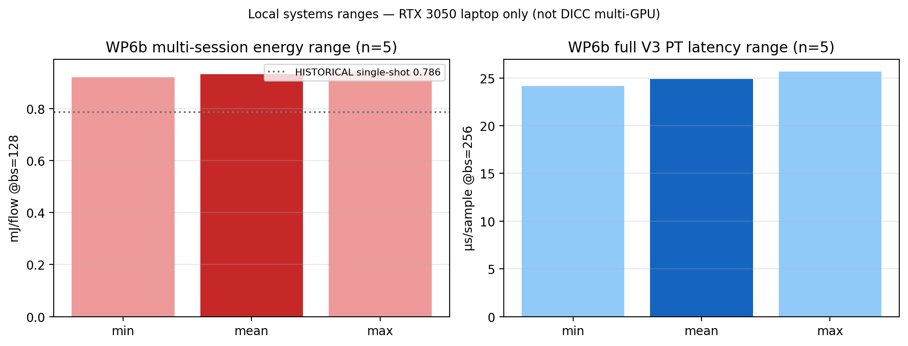

# CAD-CBA: A Class-Aware Distilled CNN–BiLSTM for Multi-Objective IoT Intrusion Detection with Operation-Matched CUDA Acceleration

> **Status: WORKING DRAFT / WRITER FEEDSTOCK — not the finished paper and not “camera-ready”.**  
> This Markdown was synced to locked artifacts so Cheran can *lead manuscript writing*.  
> Pre-manuscript authority is `docs/PRE_MANUSCRIPT_INDEX.md` + `docs/RESULTS_INDEX.md` + gate JSON.  
> The sibling `CAD_CBA_v1_MANUSCRIPT.pdf` (22 Jul 2026) is **STALE** vs this MD — do not share the PDF as current.

**Document type:** Working draft (numbers synced Aug 2026; prose still for venue rewrite)  
**Method freeze:** CAD-CBA-v1 · **Option A** CUDA (per-block / operation-matched only)  
**Champion weights:** `model/best_model_botiot_twostage.pth` · md5 `80a90f7cc210276300eaa90173a5a385`  
**Authority for numbers:** `docs/RESULTS_INDEX.md` · on-disk gates under `benchmarks/results/`  
**Open (not claimed):** DICC B3 **post_fix** server latency (Option B: historical PRE_FIX only)  

| Field | Value |
|-------|-------|
| Title (locked T1) | CAD-CBA: A Class-Aware Distilled CNN–BiLSTM for Multi-Objective IoT Intrusion Detection with Operation-Matched CUDA Acceleration |
| Authors | *[PI to finalise author list and order]* |
| Affiliations | *[PI to finalise affiliations]* |
| Correspondence | *[PI email]* |
| Venue target | *[PI to select — systems / multi-obj IDS venue]* |
| Keywords | IoT intrusion detection; class imbalance; knowledge distillation; multi-objective evaluation; CUDA acceleration; BoT-IoT; protocol-fair baselines |

> **Scope of this draft.** Local science and local systems evidence are complete for the sealed BoT package, corrected ToN, and local parity gates. DICC multi-compiler and **pre_fix** B3 wall-clock tables exist and may be cited with that label; **post_fix** server B3 latency is **not** claimed. All load-bearing numbers trace to sealed JSON on this machine (see §8.3 Claim sources).

---

## Abstract

IoT intrusion detection must handle extreme class imbalance and low-latency edge constraints. Tree ensembles often top pure accuracy on static tabular flows, while deep models remain preferred for GPU deployment, incremental adaptation, and systems co-design. Unfair protocols and framework-only acceleration claims, however, obscure real trade-offs: prior work often siloes detection quality from deployment metrics, tunes without a sealed test, or reports single-shot laptop latencies as multi-platform facts. Full-pipeline “Custom CUDA versus full model” comparisons are also invalid when kernels implement only operation-matched blocks (**Option A**).

We freeze **CAD-CBA-v1**: a V3 CNN–BiLSTM–Attention student distilled from an **ensemble** of tree teachers (mean RF+XGB+LGBM soft labels, α=**0.6**, T=**10**); **focal** loss (γ≈**1.92**); Optuna train hyperparameters (`config/hpo_best.yaml`); **shuffle** sampling; and **argmax** decode. Evaluation uses protocol `botiot_v1` with fair classical and neural baselines, a full ablation ladder, multi-objective Pareto analysis, local multi-session systems ranges under Option A CUDA, structured evidence with dispatch timing, and a ToN recipe-transfer honesty check.

On BoT-IoT **sealed multi-seed TEST** (n=5, freeze path A), CAD-CBA-v1 reaches macro-F1 **0.9780±0.0033**, min-class **0.9292**, and Theft **1.0000** (champion md5 **`80a90f7cc210276300eaa90173a5a385`**). Protocol classical pure-F1 remains led by LightGBM (**0.9818** val) with RF at **0.9778** val; the published RF **0.9864** is a **different pipeline** and is shown only as a dual bar. The package ladder tops at A7 **0.9699** (seed42), while attention+CE alone **hurts** versus plain CNN–BiLSTM (A4 **0.7378** ≪ A3 **0.9493**). Multi-objective ranking places G6 MLP first on an a priori composite (**0.9056** @ **4.33** µs, F1 0.9285). Local systems (WP6b, n=5 sessions, RTX 3050) report **exploratory** energy **0.920–0.943** mJ/flow (mean **0.933**, CV **1.05%**), PT@256 **24.15–25.68** µs/sample (mean **24.90**, CV **2.22%**), CUDA derived pipeline **565.2–570.3** µs (**Option A** block sum — not full V3 parity), bulk batched throughput **~25,899** f/s @bs=128 only, and peak alloc **322.2** MiB. Explainability is scoped: dispatch p99 **16.60** µs, rank correlation **0.9636**, faithfulness mass **0.5109**, free-form LLM feature-mention **0.333** — **no** full explainable title claim. On ToN-IoT under leakage-safe protocol `toniot_leakage_safe_v1` (seed **42**, random stratified, **not** official split), corrected test macro-F1 is CNN **0.8075** vs RF **0.9626**; historical clean **0.9526/0.9851/+15.4%** is **INVALID**.

Under a sealed, protocol-fair evaluation, CAD-CBA-v1 delivers **near-RF multi-seed test detection** with **strong minority (Theft) recognition**. The primary scientific claim is a **valid accuracy–efficiency multi-objective story** with **operation-matched CUDA** and **local multi-session latency ranges** — not pure-F1 supremacy over LightGBM, not full custom CUDA vs full V3, and not **post_fix** multi-GPU B3 latency leadership.

---

## 1. Introduction

### 1.1 Motivation

Edge and campus IoT deployments need detectors that (i) remain robust under severe class imbalance, (ii) support GPU inference with predictable latency and energy, and (iii) admit honest comparison against strong classical baselines on the **same** data protocol. Much of the literature optimises one axis (pure F1, or single-shot latency) and then generalises beyond the measured hardware and training recipe. Professor feedback on our interim report emphasised multi-objective contribution, protocol-fair baselines, sealed-test discipline, and systems claims that do not over-reach the measured platform.

### 1.2 Research questions

| RQ | Question | Locked answer (this paper) |
|----|----------|----------------------------|
| **RQ1** | Does CAD-CBA improve detection under protocol-fair evaluation? | Sealed multi-seed **test** macro-F1 **0.9780±0.0033** ≈ protocol RF val **0.9778**; does **not** beat protocol LGBM val **0.9818** or published RF **0.9864** (other pipeline). Detection alone is not the sole headline. |
| **RQ2** | Does it improve minority recognition? | **Yes on protocol test:** Theft mean **1.0**, min-cls mean **0.9292** (n=5). |
| **RQ3** | Does it reduce latency or memory on the measured GPU? | **Yes on local RTX 3050:** PT@256 **24.15–25.68** µs/sample; energy **0.920–0.943** mJ/flow; peak alloc **322.2** MiB; multi-obj composite G6 **0.9056** @4.33 µs. |
| **RQ4** | Are systems results valid across GPUs / multi-day? | **Partial / honest:** DICC multi-compiler and **pre_fix** B3 wall-clock exist (PT wins B3, e.g. V100S ~**363** vs CUDA ~**513** µs); **post_fix** server B3 rebench **not** claimed. Local ranges ≠ portable post_fix leadership. |
| **RQ5** | Does explainability add measurable value? | **Dispatch + structured evidence yes; free-form LLM quality no** (full explainable claim dropped). Dispatch **16.60** µs p99 only. |

### 1.3 Contributions

1. **CAD-CBA-v1 method package** fully frozen and evaluated: ensemble KD + focal + Optuna train HPs + V3 backbone under protocol `botiot_v1`, with sealed multi-seed BoT **test**.  
2. **Protocol-fair classical and neural baselines** on the same splits, with dual-bar honesty versus published RF.  
3. **Ablation and negative results** showing package-level credit (A7) and rejecting attention-alone, multi-scale CNN, gated fusion, SupCon, ASL, neural-teacher KD, and stratified batching.  
4. **Multi-objective Pareto** analysis and **local multi-session** latency/energy/VRAM ranges under Option A CUDA discipline.  
5. **Scoped XAI**: low-overhead dispatch (**16.60** µs p99) + structured evidence; no full “LLM-explainable IDS” title claim.  
6. **ToN multi-dataset honesty** under corrected leakage-safe protocol (`toniot_leakage_safe_v1`): RF test **0.9626**, CNN **0.8075**, with mitm weakness and invalid-clean quarantine disclosed.

### 1.4 Non-claims (explicit)

- We do **not** claim pure-F1 supremacy over protocol LightGBM.  
- We do **not** claim full Custom-CUDA versus full V3 PyTorch **parity** or full-pipeline speedup (Option A).  
- We do **not** claim DICC B3 latency as **post_fix** (historical V100S ~513 vs ~363 µs is **PRE_FIX** only).  
- We do **not** claim portable “CUDA B3 beats matching PT on servers” (PT wins B3 **pre_fix**).  
- We do **not** claim full free-form LLM explainability (feature-mention **0.333**); dispatch only is **16.60** µs p99.  
- We do **not** claim ToN clean **0.9526 / 0.9851 / +15.4%** (INVALID; DATA-TON-001).  
- We do **not** claim bulk batched **~25,899** f/s as a live-stream SLA, nor energy as certified power metrology (**exploratory**).

---

## 2. Related work

### 2.1 Deep and hybrid IDS for IoT / tabular flows

CNN, LSTM/BiLSTM, and hybrid CNN–RNN stacks are widely applied to flow and packet features. Many report high accuracy on public datasets but omit sealed-test discipline, protocol-matched classical baselines, or multi-seed stability. Transformer-style temporal models are sometimes proposed as drop-in upgrades; under our equal-budget protocol baseline they underperform (G12 val macro-F1 **0.5808** ≪ G11 **0.9493**).

### 2.2 Class imbalance in intrusion detection

Focal loss, class-balanced losses, oversampling (e.g. SMOTE), and threshold search are common. Our four-way loss compare under protocol fine-tuning finds **focal** best (val **0.9780**); class-balanced focal (**0.9121**) and logit adjustment (**0.9225**) hurt macro-F1. Validation threshold search does not beat **argmax**. Stage-A SMOTE remains a KD-path tool; Stage-B fine-tune uses real train only.

### 2.3 Knowledge distillation and teacher ensembles

Distilling tree ensembles into compact neural students is attractive for deployment. We compare RF, XGB, LGBM, none, and **ensemble** soft-label teachers under identical Stage-A KD; the ensemble student val **0.9401** wins. A strong neural teacher (G11) yields a weaker student (**0.8513**).

### 2.4 GPU acceleration and systems claims

Framework compilers (TensorRT, ORT, `torch.compile`) and hand-written CUDA kernels both appear in IDS systems papers. Invalid comparisons arise when custom kernels cover only operation-matched blocks but are reported as full-model speedups. We adopt **Option A**: report per-block / derived pipeline CUDA latency and full V3 PyTorch absolute latency **separately**, never as parity.

### 2.5 Explainable IDS and LLMs

Recent LLM-assisted IDS work often emphasises narrative quality without faithfulness/consistency metrics, or conflates prompt-dispatch cost with generation latency. We measure occlusion faithfulness (**0.5109** top-3 mass), rank consistency (**0.9636**), dispatch p99 (**16.60** µs), generation mean (**~7400** ms), and free-form feature-mention (**0.333**), then **drop** a full explainable title claim while retaining structured evidence + dispatch.

### 2.6 Positioning gap table

| Gap in prior practice | Our response | Evidence |
|----------------------|--------------|----------|
| Test used during selection | Sealed test until freeze lock (B14) | `FINAL_CONFIG_FREEZE_CARD.md`, `sealed_test/` |
| Classical baselines on other pipelines | Protocol-fair RF/XGB/LGBM/SVM/LR | `baselines_classical/` |
| Single-shot laptop latency as “the” number | Multi-session ranges n=5 | `wp6b_local_ranges/` |
| Full-pipeline CUDA vs full PT false parity | Option A language + fidelity | `numerical_fidelity.json` |
| Architecture novelty without ablation | A1–A7 + C\* negatives | `ablation_ladder/`, `cstar_bounded/` |
| Full LLM-XAI claim without metrics | Drop full claim; keep structured | `xai/summary.json` |
| Cross-GPU claim from one laptop | DICC pre_fix tables + no post_fix B3 claim | `DICC_*` reports; B3 report PRE_FIX |

---

## 3. Method: CAD-CBA-v1

### 3.1 Architecture (V3)

Input: 10 BoT-IoT flow features → linear projection to 64 → reshape **[2, 32]** → two 1D-CNN layers (64→128, kernel 3, BN, ReLU, pool) → BiLSTM (128→64, bidirectional) → multi-head attention (4 heads) → dense 64 + dropout → 5-class softmax. Trainable parameters of the production package path: **530,181** (Pareto/systems tables).



**Figure 1.** CAD-CBA-v1 architecture and two-stage training (dims from `config/config.yaml`; train hyperparameters from `config/hpo_best.yaml`).

### 3.2 Training recipe (frozen)

| Stage | Role | Key settings |
|-------|------|--------------|
| **Stage A KD** | Distill student from soft labels | Teacher = mean(RF, XGB, LGBM) probs; α=**0.6**, T=**10**; SMOTE on train only; val for selection |
| **Stage B FT** | Real-data fine-tune | **No** SMOTE; **focal** γ≈**1.9166**; lr≈**5.893e-5**; batch **1024**; dropout≈**0.148**; attn dropout≈**0.214**; weight decay≈**1.92e-4**; **cosine** schedule; **shuffle** sampler |
| **Decode** | Inference decision | **argmax** (val threshold search: no macro/min lift) |

Init path for sealed multi-seed test (**path A**):  
`model/best_model_botiot_distill_a0.6_T10.0_focal2.pth` + Stage-B FT with `hpo_best.yaml`, seeds 42–46.

### 3.3 Production champion (systems / XAI path)

Production weights used for systems ranges, the historical energy table, and the XAI suite:

- Path: `model/best_model_botiot_twostage.pth`  
- md5: **`80a90f7cc210276300eaa90173a5a385`**  
- Never overwritten without BACKUP and explicit approval.

### 3.4 What is *not* in the package

Multi-scale CNN (C4 **0.9167**), gated fusion (C5 **0.9132**), SupCon (C7 **0.7732**), asymmetric loss (C8 **0.8012**), MC-dropout selective decoding (no high-coverage lift), neural teacher KD (E6 **0.8513**), full architecture Optuna (B2–B4 plateau reject), class-balanced weights on neural focal, and stratified inv-freq batching (D6 **0.9209** ≪ shuffle **0.9791**).

---

## 4. Experimental protocol

### 4.1 Dataset and splits (BoT-IoT)

Protocol ID: **`botiot_v1`**. Features: 10 numerical flow features (freeze list in `scripts/protocol/botiot.py`). Classes: DDoS, DoS, Normal, Reconnaissance, Theft. Official test CSV is **sealed** for all model selection (HPO, thresholds, early stopping). Stage A uses stratified val + SMOTE on train only; Stage B uses stratified val + **no** SMOTE.



**Figure 2.** Extreme train imbalance and official test support (log scale). Theft test support is only **14** — minority metrics are reported with that honesty.

### 4.2 Metrics

Primary: **macro-F1**. Always log: balanced accuracy, weighted F1, min per-class F1, per-class F1 (especially Theft), and confusion matrices. Systems: µs/sample (multi-session), mJ/flow, peak allocated VRAM, n_params, Option A CUDA block/pipeline µs.

### 4.3 Seeds and hardware

- Multiruns / sealed test seeds: **42–46** (n=5).  
- Local systems: NVIDIA GeForce **RTX 3050 6GB** Laptop GPU; WP6b **5** sessions; warm-up **50** sync forwards.  
- DICC V100S/A100: multi-compiler absolutes and **pre_fix** B3 CUDA-vs-PT wall-clock may be cited with labels; **post_fix** B3 server latency is **not** claimed.
### 4.4 Baselines (same protocol)

**Classical:** LR, LinearSVC, RF, XGB, LGBM (G5 balanced multiclass).  
**Neural (equal fixed CE budget, seed42):** MLP, 1D-CNN, LSTM, BiLSTM, CNN–LSTM, CNN–BiLSTM, lightweight temporal transformer.  
**Published RF 0.9864:** dual bar only (different pipeline) — never mixed as protocol-fair.

---

## 5. Results

### 5.1 Overall detection — sealed multi-seed TEST (B14)

**Table 1.** Sealed multi-seed BoT TEST (CAD-CBA-v1 path A; seeds 42–46). Source: `benchmarks/results/sealed_test/summary.json`.

| Seed | val macro-F1 | test macro-F1 | test min-cls | test Theft |
|------|--------------|---------------|--------------|------------|
| 42 | 0.9791 | 0.9787 | 0.9333 | 1.0000 |
| 43 | 0.9587 | 0.9798 | 0.9369 | 1.0000 |
| 44 | 0.9797 | 0.9798 | 0.9375 | 1.0000 |
| 45 | 0.9787 | 0.9722 | 0.9014 | 1.0000 |
| 46 | 0.9483 | 0.9796 | 0.9369 | 1.0000 |
| **Mean±std** | 0.9689±0.0145 | **0.9780±0.0033** | **0.9292** | **1.0000** |

**Honesty notes.** Seed 46 has weaker **val** (0.9483) but strong **test** (0.9796) — both are reported. Do not replace the test mean with the val multirun **0.9714±0.0109**. Production champion md5 is **unchanged**.

**Table 1b.** Multi-seed mean **test** per-class F1 (n=5; means of seed-wise class F1). Support from seed-42 test split shown for scale.

| Class | Mean test F1 | Test support (s42) |
|-------|-------------:|-------------------:|
| DDoS | 0.9838 | 385309 |
| DoS | 0.9813 | 330112 |
| Normal | 0.9292 | 107 |
| Reconnaissance | 0.9958 | 18163 |
| Theft | **1.0000** | **14** |
| Macro (mean±std) | **0.9780±0.0033** | — |

Min-class F1 mean **0.9292** coincides with mean Normal F1 under this split. Perfect Theft F1 is real on this test set but must be read with support **14**.



**Figure 3.** Dual accuracy bars: sealed multi-seed test versus protocol classical val versus published RF (other pipeline).



**Figure 4.** Representative sealed-test confusion matrix (seed 42; test macro-F1 0.9787). Multi-seed mean remains **0.9780±0.0033**.

### 5.2 Protocol-fair classical baselines (val)

**Table 2.** Classical baselines under `botiot_v1` (val; test sealed during selection).

| Model | val macro-F1 | Notes |
|-------|--------------|-------|
| LGBM (balanced) | **0.9818** | Protocol pure-F1 ceiling |
| RF | 0.9778 | Protocol-fair |
| XGB | 0.9762 | |
| LR | 0.5231 | |
| LinearSVC | 0.4268 | Weak under extreme imbalance |
| Published RF | 0.9864 | **Different pipeline** — dual bar only |

**RQ1 answer:** CAD-CBA sealed test **0.9780±0.0033** is near protocol RF and below protocol LGBM pure F1. The paper’s primary contribution is therefore **not** “we beat every classical model on F1 alone.”

### 5.3 Neural baselines (val, equal budget)

**Table 3.** Neural baselines under equal fixed CE budget (seed42).

| Model | val macro-F1 |
|-------|--------------|
| G11 CNN–BiLSTM | **0.9493** |
| G6 MLP | 0.9285 |
| G10 CNN–LSTM | 0.8159 |
| G8 LSTM | 0.8099 |
| G9 BiLSTM | 0.8058 |
| G7 1D-CNN | 0.6221 |
| G12 Transformer | **0.5808** |

Transformer is **not** a free win under this budget. G11 matches ablation A3.

### 5.4 Ablations and package composition

**Table 4.** Ablation ladder (seed42, val).

| Row | val macro-F1 | Role |
|-----|--------------|------|
| A7 full CAD-CBA-v1 | **0.9699** | Package top |
| A3 cnn_bilstm CE | 0.9493 | Strong backbone |
| A6 +ens KD | 0.9346 | KD lift vs A5 |
| A5 attn+focal | 0.8684 | Focal helps vs A4 |
| A2 bilstm | 0.8058 | |
| A4 attn+CE | **0.7378** | Attention not free |
| A1 cnn only | 0.6221 | Weak |



**Figure 5.** Ablation ladder: full package (A7) wins; attention+CE (A4) underperforms plain CNN–BiLSTM (A3).

**Novelty (locked).** CAD-CBA-v1 is **not** “just a standard CNN–BiLSTM.” Novelty is **composition under a frozen protocol**: focal training, ensemble tree KD, Optuna-selected train HPs, and a systems stack (export fidelity + Option A CUDA + multi-session energy/latency). Ablations show the package path wins while attention alone is not a free gain.

### 5.5 Teachers / KD

**Table 5.** Stage-A KD student val macro-F1 (α=0.6, T=10, γ=2, seed42).

| Teacher | Student | Decision |
|---------|---------|----------|
| **ensemble** | **0.9401** | **Selected for package** |
| RF | 0.9346 | Documented fallback |
| none | 0.9326 | hard-label control |
| XGB | 0.9270 | strong teacher, weaker student |
| LGBM | 0.8829 | weak path |
| Neural G11 (E6) | 0.8513 | rejected |

Do not mix Stage-A KD scores with Stage-B fine-tune multirun means.

### 5.6 Loss / sampler / thresholds (imbalance)

| Experiment | Result | Package decision |
|------------|--------|------------------|
| CE vs focal vs focal_cb vs logit_adj | focal **0.9780** best; CB 0.9121; logit 0.9225 | **focal selected** |
| Val thresholds on focal | all variants = argmax 0.9780 | keep **argmax** |
| Stratified inv-freq vs shuffle | 0.9209 vs **0.9791** | keep **shuffle** |

### 5.7 Hyperparameter search (Optuna)

Stage A: 20 TPE trials (subsampled train, short epochs); Stage B: full-train refine of top-3. Source: `benchmarks/results/hpo/summary.json`.

**Table 5b.** Stage-B full-train refine ranking (seed42). Stage-A rank ≠ Stage-B rank.

| Stage-A rank | Trial | Stage-A val | Full-train val | Min-cls | Theft | Package |
|-------------:|------:|------------:|---------------:|--------:|------:|---------|
| 2 | **8** | 0.9787 | **0.9791** | 0.9351 | 1.0000 | **Selected** (`hpo_best.yaml`) |
| 1 | 11 | 0.9787 | 0.9721 | 0.9014 | 1.0000 | not selected |
| 3 | 13 | 0.9786 | 0.8656 | 0.5000 | 0.5000 | unstable under full data |

Winner parameters (exact) are listed in Appendix A. Multi-seed HPO confirm (original distill + `hpo_best`) yields val mean **0.9689±0.0145** (n=5); seed42 reproduces **0.9791**. The multi-seed mean does **not** beat WP1b multirun **0.9714±0.0109** — train HPs remain locked, without a mean-win claim over the prior multirun.

### 5.8 Multi-objective Pareto

A priori composite ranking places **G6 MLP score 0.9056** @ **4.33** µs/sample with F1 **0.9285** first on the efficiency-weighted ranking. F1-oriented points include A7 (**0.9699** @ ~26 µs) and classical LGBM/RF references. Figures: `figures/fig_pareto_f1_latency.png`, `figures/fig_pareto_f1_params.png`.

**Interpretation.** The multi-objective story allows classical models to keep pure-F1 leadership while neural models own deployable size/latency/GPU paths — matching the contribution bar that detection need not be the sole headline.

### 5.9 Systems: latency, energy, VRAM (local multi-session)

**Table 6.** Local multi-session ranges (n=5 sessions, RTX 3050, champion frozen). Source: `wp6b_local_ranges/summary.json`.

| Metric | Session-mean range | Mean ± std | CV% | 95% CI | Scope |
|--------|--------------------|------------|-----|--------|-------|
| Energy mJ/flow @bs=128 | **0.920–0.943** | **0.933 ± 0.010** | 1.05 | [0.920, 0.945] | **Exploratory** board power |
| PT µs/sample @bs=256 | **24.15–25.68** | **24.90 ± 0.55** | 2.22 | [24.21, 25.59] | Full V3 absolute |
| CUDA derived pipeline µs | **565.2–570.3** | 567.4 | 0.34 | — | Option A **block sum** |
| CUDA block3 FP16 µs | **503.2–508.5** | 505.6 | 0.44 | — | Local only; ≠ DICC post_fix |
| Bulk throughput f/s @bs=128 | **~25,899** | — | — | — | **Bulk batched only** |
| Peak alloc MiB | **322.2** | — | — | global max | Allocated VRAM |



**Figure 6.** Local multi-session energy and PT ranges. Energy is **exploratory**. Do **not** mix WP6b mean energy **0.933** with historical single-shot **0.786** mJ/flow (`energy_table/`, labeled HISTORICAL). CUDA pipeline is Option A **block sum**, not full V3 parity. Throughput **~25,899** f/s is bulk batched only.

Warm-up protocol: **50** discarded sync forwards. Batch-size sensitivity: bs∈{1,8,32,64,128,256,512,1024} multi-session tables in `systems_i8_h3/`.

### 5.10 CUDA Option A, B3 honesty, and numerical fidelity

**Option A discipline.** Per-block / derived-pipeline Custom CUDA latency and full V3 PyTorch absolute latency are reported **separately**. We do **not** claim full custom CUDA pipeline versus full V3 as a parity speedup.

**Local B3 production-weight parity (claimable).** Gate `benchmarks/results/block3_parity_gate.json`: `valid=true`, `kernel_status=post_fix`, champion md5 match. GPU inject vs PT full-sequence max abs error **~3.43×10⁻⁶**; hybrid logits (CUDA B3 seq through V3 suffix vs PT) max abs **~5.72×10⁻⁶**. This is **local numerical fidelity**, not a server latency claim.

**DICC B3 wall-clock (PRE_FIX only).** Historical multi-session means remain **pre_fix** binaries: e.g. V100S CUDA B3 FP16 ~**513** µs vs matching PT B3 ~**363** µs (PT wins; stable across sessions). Do **not** label these as post_fix. B1/B2/B4 CUDA still win on the same campaigns under Option A. Source: `docs/DICC_B3_CUDA_VS_PT_REPORT.md`.

**Framework logit parity (local).** Gate `benchmarks/results/framework_parity_gate.json`: eager CUDA, ORT (CPU/GPU), and `torch.compile` **pass**; native TensorRT backend **skipped** — no TRT logit-parity claim.

**Export / self-checks.** Export path: **bit-identical** real-weight blocks (max abs error 0). CUDA self-checks: **all PASS**. FP16 block3 uses documented looser tolerance.

### 5.11 Explainability (scoped)

**Table 7.** XAI suite on BoT val, champion frozen (`xai/summary.json`).

| Metric | Value | Scope |
|--------|-------|-------|
| Dispatch p99 overhead | **16.60** µs | Dispatch only |
| Occlusion rank Spearman | **0.9636** | Consistency |
| Faithfulness top-3 mass | **0.5109** | Proxy only |
| Structured usefulness (auto rubric) | **1.0** | Templates; not a human SOC study |
| Free-form feature-mention | **0.333** | Weak |
| Generation mean | **~7400** ms | Never conflate with dispatch |

**Policy:** drop a full “explainable IDS” title/abstract claim; keep dispatch + structured evidence.

### 5.12 Multi-dataset: ToN-IoT (corrected, leakage-safe)

**Principal multi-dataset claim** uses protocol **`toniot_leakage_safe_v1`** (artifact: `benchmarks/results/toniot_corrected/summary.json`). Settings: **13-feature allowlist**, seed **42**, **random stratified** 60/20/20 (**not** an official temporal/host ToN split), train-only encoders/scaler, **no SMOTE**, **no KD**, hard-label CNN with class-weighted CE, single seed.

**Table 8.** Corrected ToN-IoT test macro-F1 (seed 42).

| Model | test macro-F1 | Notes |
|-------|---------------|-------|
| RF (`class_weight=balanced`) | **0.9626** | Same leakage-safe split |
| CNN–BiLSTM (hard-label) | **0.8075** | Class-weighted CE; no KD |

**Minority honesty (CNN mitm on test):** F1 **~0.111** (precision **~0.059**, recall **~0.909**) — high recall with very low precision; this class drives much of the CNN macro gap vs RF.

**Invalid clean path (quarantined):** CNN **0.9526** / RF **0.9851** / **+15.4%** improvement language are **INVALID** (DATA-TON-001: target-derived `label` leakage and related issues). Never use as active evidence.

**Older package path (optional comparable only):** WP8 13-feat `toniot_final` neural ~**0.811** vs RF ~**0.939** remains a labeled prior; **prefer Table 8 corrected numbers** for multi-dataset prose.

### 5.13 Cross-GPU / DICC status (honest labels)

| Cell | Status |
|------|--------|
| V100S / A100 multi-compiler absolute matrix | **Available** — cite with protocol; separate from incomplete Custom CUDA ranges |
| Same-GPU B3 CUDA vs matching PT (DICC) | **Available as PRE_FIX historical** (PT wins; e.g. V100S ~513 vs ~363 µs) — **not** post_fix |
| B3 multi-session post_fix rebench after kernel fix | **Open** — do not invent |
| Local B3 production-weight parity | **Done** (`post_fix`, §5.10) |

Local WP6b ranges must **not** be generalised as portable post_fix B3 leadership.

---

## 6. Discussion

### 6.1 What the sealed test allows us to say

Multi-seed test macro-F1 **0.9780±0.0033** with Theft **1.0** is a strong, protocol-honest detection result. It is **near** protocol RF and **below** protocol LGBM on pure F1. That forces the paper’s lead narrative onto **multi-objective validity** and **systems honesty**, which is exactly the contribution bar from external feedback.

### 6.2 Package novelty versus single-module novelty

Attention alone can hurt (A4). Multi-scale and gated variants fail bounded probes. SupCon and ASL collapse under budget. The scientific object is therefore the **evaluated package** (focal + ensemble KD + HPO + V3 + systems discipline), not a single new layer sold without measurement.

### 6.3 Dual bars and dual energy numbers

Always label:

- Protocol val versus sealed **test**.  
- Protocol RF/LGBM versus published RF **0.9864**.  
- WP6b multi-session energy **0.920–0.943** versus historical single-shot **0.786**.

### 6.4 Negative results as evidence

Failed variants remain in `benchmarks/results/` and in this manuscript’s tables. They are part of the contribution (what not to add).

### 6.5 Implications for deployment

For edge GPU deployments that already prefer a neural path, CAD-CBA-v1 offers near-RF multi-seed test quality, strong Theft recognition under protocol, modest peak VRAM, and quantified multi-session energy/latency ranges. Operators who optimise pure tabular F1 alone may still prefer LightGBM under this protocol. Cross-platform SLAs require DICC multi-day evidence before any portability statement.

---

## 7. Threats to validity

1. **Val versus test.** Most HPO/ablation/baseline numbers are **val-only**. Sealed multi-seed **test** is separate (B14).  
2. **Dual accuracy bars.** Protocol RF/LGBM ≠ published RF 0.9864 pipeline.  
3. **Single-seed ladders.** A1–A7 and G6–G12 are seed **42** / fixed budget — multi-seed stability is B14 / multiruns.  
4. **Local ≠ portable.** WP6b is **RTX 3050 laptop only**.  
5. **Option A construct validity.** Per-block CUDA latency ≠ “full model Custom CUDA versus full V3.”  
6. **Energy construct.** Energy is **exploratory** (board-power integration). WP6b multi-session range is preferred over single-shot **0.786** historical.  
7. **XAI conclusion validity.** No human SOC study; free-form LLM weak; structured templates use an automatic rubric; dispatch **16.60** µs p99 is dispatch-only.  
8. **ToN external validity.** Corrected path is random stratified (not official ToN split); CNN **0.8075** ≪ RF **0.9626**; mitm F1 ~**0.111**. Clean **0.9526/0.9851** INVALID.  
9. **Theft support.** Test Theft n=**14** — perfect Theft F1 is real under this test set but limited support must be stated.  
10. **B3 construct.** Local parity **post_fix** ≠ DICC wall-clock **pre_fix**. Option A forbids full custom CUDA vs full V3 parity claims.  
11. **Historical text blocks.** Older draft blocks may mix pre-protocol or invalid ToN numbers; **RESULTS_INDEX / corrected gates** and this manuscript override for CAD-CBA-v1.

---

## 8. Reproducibility

```text
Protocol: botiot_v1 (scripts/protocol/)
ToN protocol: toniot_leakage_safe_v1 (scripts/protocol/toniot_leakage_safe.py)
Method: CAD-CBA-v1 (docs/execution_plan/METHOD_PACKAGE_DECISION.md)
Train HPs: config/hpo_best.yaml
Freeze: docs/execution_plan/FINAL_CONFIG_FREEZE_CARD.md
Champion: model/best_model_botiot_twostage.pth
  md5 80a90f7cc210276300eaa90173a5a385
Sealed test: benchmarks/results/sealed_test/
ToN corrected: benchmarks/results/toniot_corrected/summary.json
B3 parity: benchmarks/results/block3_parity_gate.json
Framework parity: benchmarks/results/framework_parity_gate.json
Systems: benchmarks/results/wp6b_local_ranges/
Results index: docs/RESULTS_INDEX.md
Claims: docs/execution_plan/CLAIMS_REGISTRY.md
Verify: PYTHONPATH=. python3 scripts/verify_claims.py
PDF build: PYTHONPATH=. python3 scripts/build_manuscript_pdf.py
Option A: per-block CUDA only; no full-pipeline parity claims
DICC B3 latency: PRE_FIX historical only (see DICC_B3_CUDA_VS_PT_REPORT.md)
Spine: docs/execution_plan/WP9b_MANUSCRIPT_SPINE.md
This draft: docs/manuscript/CAD_CBA_v1_MANUSCRIPT.md
Figures: docs/manuscript/figures/
```

All load-bearing public numbers are registered in the claims package (**64** claims at last rebuild, including B14 multi-seed test per-class means) and mapped in `docs/RESULTS_INDEX.md`. Rebuild and re-verify after any prose that introduces new load-bearing numbers.

### 8.1 Data and code availability (PI to finalise venue wording)

- Protocol scripts, configs, and claims verifier are in the project repository.  
- Result JSON under `benchmarks/results/` is machine-local (often gitignored); committed manifests record md5s and headlines.  
- Dataset redistribution follows original BoT-IoT / ToN-IoT licences (*PI to confirm venue data statement*).

### 8.2 Ethics and dual-use

This work studies intrusion detection on public research datasets. Models and CUDA kernels could be misused for adversarial research; we release evaluation protocols intended for defensive measurement. No human-subject study is reported.

### 8.3 Claim sources (artifacts)

| Claim family | Artifact path |
|--------------|---------------|
| ToN corrected multi-dataset (RF **0.9626** / CNN **0.8075**) | `benchmarks/results/toniot_corrected/summary.json` |
| B3 local production-weight parity (`valid=true`, `post_fix`) | `benchmarks/results/block3_parity_gate.json` |
| Framework logit parity (eager/ORT/compile; TRT skipped) | `benchmarks/results/framework_parity_gate.json` |
| Master claim → artifact map (use_in_manuscript flags) | `docs/RESULTS_INDEX.md` |
| BoT sealed multi-seed principal (**0.9780±0.0033**) | `benchmarks/results/sealed_test/summary.json` |
| DICC B3 PRE_FIX wall-clock (PT wins) | `docs/DICC_B3_CUDA_VS_PT_REPORT.md` |

---

## 9. Conclusion

We presented **CAD-CBA-v1**, a class-aware distilled CNN–BiLSTM package evaluated under a sealed, protocol-fair regime. On BoT-IoT multi-seed **test**, the method reaches **0.9780±0.0033** macro-F1 with Theft **1.0**, near protocol-fair RF, while LightGBM retains the pure-F1 ceiling (**0.9818** val). Ablations credit **package composition** rather than attention alone. Local multi-session systems ranges quantify **exploratory** energy (**0.920–0.943** mJ/flow), latency (PT@256 **24.15–25.68** µs), bulk throughput (**~25,899** f/s only), and peak VRAM (**322.2** MiB) under Option A CUDA discipline (no full custom CUDA vs full V3). Local B3 production-weight parity is **post_fix**; DICC B3 wall-clock remains **PRE_FIX** (PT wins). On corrected ToN (`toniot_leakage_safe_v1`), CNN test macro-F1 **0.8075** lags RF **0.9626**; clean **0.9526/0.9851** is invalid. Explainability is scoped to dispatch (**16.60** µs p99) and structured evidence. The primary claim is therefore a **valid multi-objective accuracy–efficiency evaluation package** with honest limits — not an oversold single-number victory.

---

## Acknowledgments

*[PI: funding, compute, and collaborator acknowledgments.]*

---

## Appendix A — HPO winner parameters

| HP | Value |
|----|-------|
| lr | 5.89306076111462e-05 |
| batch_size | 1024 |
| focal_gamma | 1.9166447754858478 |
| dropout_rate | 0.14783769837532068 |
| attention_dropout | 0.21397343616689848 |
| weight_decay | 0.00019158219548093185 |
| scheduler | cosine |

Source: `config/hpo_best.yaml` / WP3 trial 8 full-train refine val **0.9791**.

## Appendix B — Figure checklist

| Figure | File | Status |
|--------|------|--------|
| Architecture | `figures/fig_architecture.png` | DONE |
| Class distribution | `figures/fig_class_distribution.png` | DONE |
| Detection dual bars | `figures/fig_detection_dual_bars.png` | DONE |
| Confusion matrix (B14 s42) | `figures/fig_confusion_matrix_b14_seed42.png` | DONE |
| Ablation ladder | `figures/fig_ablation_ladder.png` | DONE |
| WP6b systems ranges | `figures/fig_wp6b_systems_ranges.png` | DONE |
| Pareto F1–latency | `figures/fig_pareto_f1_latency.png` | DONE (copied) |
| Pareto F1–params | `figures/fig_pareto_f1_params.png` | DONE (copied) |

## Appendix C — Related-work comparison (compact)

| Theme | Typical prior claim | This work |
|-------|---------------------|-----------|
| Detection | Single split / test leakage risk | Sealed multi-seed test after freeze lock |
| Classical comparison | Different preprocess/pipeline | Protocol-fair same split + dual bar |
| Acceleration | Full-pipeline CUDA vs PT | Option A per-block + absolute PT; no full vs full V3 |
| Multi-GPU | Single laptop extrapolated | DICC pre_fix B3 honesty; no post_fix claim |
| XAI | “Explainable IDS” in title | Metrics first; full claim dropped |
| ToN | Leaky “clean” headlines | Corrected leakage-safe **0.8075/0.9626**; clean INVALID |

## Appendix D — PI venue polish checklist

| Item | Status |
|------|--------|
| Continuous journal-style abstract (5-part content preserved) | DONE this pass |
| Author / affiliation / correspondence placeholders | DONE (PI fill) |
| Venue target placeholder | DONE (PI select) |
| Sealed-test per-class mean table (from disk) | DONE Table 1b |
| HPO Stage-B refine sensitivity table (from disk) | DONE Table 5b |
| Systems table with mean±std / CV / CI | DONE Table 6 |
| Softened process jargon for reader-facing prose | DONE |
| Reproducibility + data/ethics stubs | DONE |
| PDF rebuild script | `scripts/build_manuscript_pdf.py` |
| Final journal class file / IEEE/ACM/Elsevier template | **PI** after venue choice |
| Bibliography style + BibTeX | **PI** after venue choice |
| DICC multi-compiler / PRE_FIX B3 tables | **Available** with labels |
| DICC B3 post_fix rebench | **OPEN** — do not invent µs |

---

*Local-complete draft assembled 2026-07-22 (WP9c) · PI venue polish 2026-07-22 · playlist closure audit + claims 64 (Table 1b registered) 2026-07-22 · claim-hygiene sync 2026-08-14 (corrected ToN, B3 pre_fix/post_fix honesty, RESULTS_INDEX gates). Numbers only from on-disk JSON / RESULTS_INDEX / CLAIMS_REGISTRY. No invented post_fix DICC B3 numbers.*
